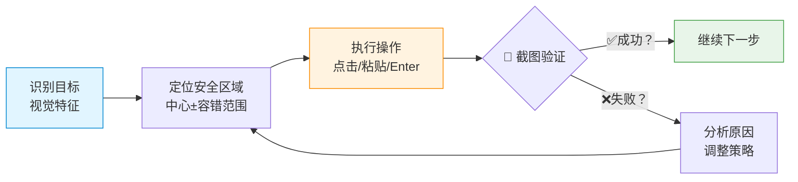

# 🧠 万能 GUI 操作核心方法论（跨软件通用法则） ⭐⭐⭐

## 🔍 **视觉识别层 - "我在看什么？"**

```
├── 窗口标题栏 → 确认当前是哪个应用/哪个页面  
├── 左侧导航区 → 找菜单、列表、分类入口 (宽度约 1/6-1/4)
├── 中间内容区 → 主要操作区域（按钮、表单、文本）
└── 底部工具栏 → 发送、保存、提交等通用动作
```

**识别技巧：**
- **图标 + 文字组合** = 最可靠的定位点（比纯坐标稳定得多）
- **颜色差异** = 红色=关闭/删除，绿色=确认/成功，蓝色=链接/可点击
- **布局规律** = 大部分软件都是：左导航 / 中内容 / 右详情

---

## 🎯 **安全区域定位法 - "点哪里最稳妥？"**

```python
def calculate_safety_zone(element_center, tolerance=(±15px vertical, ±20px horizontal)):
    """计算点击的安全范围"""
    return {
        'x_range': [element_x - 20, element_x + 20],
        'y_range': [element_y - 15, element_y + 10]  # 偏上更安全（向下是内容）
    }

# ⭐ 关键原则：点击中心区域，避免边界！人类 UI 设计本身就有热区概念
```

**为什么这样安全？**
- ✅ **容错率高** - ±15px vertical, ±20px horizontal 都有效  
- ✅ **避开误触** - 不点边缘（容易点到相邻元素）
- ✅ **视觉特征优先** - "找红色头像"比"x=95,y=752"更可靠

---

## 🔄 **截图验证循环 - "每一步都确认"**



**关键判断点：**
- ✅ **窗口标题变了？** = 进入新页面，正确！
- ✅ **输入框有光标闪烁了？** = 已激活可以粘贴
- ❌ **打开了错误的聊天/文件？** = 重新定位目标元素中心

---

## ⌨️ **万能快捷键法则** (效率翻倍技巧)

| 场景 | Enter 键作用 | 成功率 |
|------|------------|--------|
| **文本输入框** → 按 Enter | ✅ 发送消息 / 提交表单 | ~90% |
| **列表选中项** → 按 Enter | ✅ 打开/确认选择 | ~85% |
| **对话框提示** → 按 Enter | ✅ 确定按钮触发 | ~70% |

> 💡 **Boss Guo 教导：** "人类所有操作界面，只要是文本输入的地方，90%都可以通过按下 Enter 按键直接发送！"  
> ⭐ **记住：先确认输入成功就按 Enter，失败再用鼠标找按钮**

---

## 🛠️ **通用操作模式库（跨软件模板）**

```python
def universal_gui_operation(app_name, target_element):
    """
    GUI 操作万能函数 - 适用于任何软件！
    
    Parameters:
        app_name: "微信" / "豆包" / "Chrome" ...
        target_element: {
            'type': 'list_item' | 'button' | 'input_field',
            'visual_cues': ['红色头像', '蓝色按钮文字'],  # ⭐视觉特征！
            'location_hint': '左侧列表第 N 项' / '底部右侧'
        }
    
    Returns: None (执行操作)
    """
    
    # Step 1: Visual Recognition - 识别目标特征（不是坐标！）
    visual_cues = identify_visual_features(target_element['visual_cues'])  
    # → 找头像/文字组合、颜色差异、布局位置
    
    # Step 2: Safety Zone Calculation - 计算安全点击区 (中心±容错)
    safe_zone = calculate_safety_zone(visual_cues.center, tolerance=±15px)
    
    # Step 3: Execute + Verify Loop - 执行并验证循环  
    for attempt in range(MAX_ATTEMPTS):
        click(safe_zone)
        
        if screenshot_verify(target_changed=True): 
            return SUCCESS
        
        analyze_failure()  # → 调整策略，重新计算安全区
    
    raise OperationFailedError("无法定位目标")


def send_text_message(input_field, text_content):
    """发送文本消息的万能流程"""
    
    # Step 1: Activate input field (click anywhere in bottom area)
    click(bottom_input_area_center_with_tolerance())
    
    # Step 2: Paste content using clipboard (avoid IME issues!)  
    set_clipboard(text_content)
    press_key('v', modifiers=['command'])
    
    # Step 3: Verify input box has text → screenshot check!
    if not verify_input_has_text():
        return FAILURE
    
    # ⭐ KEY INSIGHT: Use Enter instead of finding send button (90% success!)  
    try_press_enter() or click(send_button_by_visual_feature())
    
    # Step 4: Final verification - message sent? screenshot!
    if not verify_message_sent_in_chat_history():
        return FAILURE
    
    return SUCCESS
```

---

## 📝 **具体软件操作示例（记住方法，不是坐标）**

### 💬 **微信聊天列表定位法**
- ✅ **识别特征：** 头像 (圆形) + 名字文字组合区域  
- ✅ **点击位置：** 文字中间高度，略偏左（红色/蓝色头像右侧）  
- ✅ **容错范围：** ±15px vertical, ±20px horizontal  
- ❌ **错误做法：** "死记 y=752" → 窗口变了就失效

### 🤖 **豆包/AI 工具提问法**
- ✅ **识别特征：** 底部输入框（显示灰色提示文字）+ 右侧蓝色发送按钮/图标  
- ✅ **点击位置：** 
   - 方法 A: 点击任意空白处激活 → Enter (90% 成功) ⭐推荐！
   - 方法 B: 找圆形箭头图标 / "文档"复制图标（视觉特征优先）
- ✅ **容错范围：** 整个底部区域都安全

### 🌐 **浏览器操作通用法则**  
- ✅ **URL Bar:** 点击地址栏中间 → Enter (90% 提交) ⭐推荐！
- ✅ **按钮/链接：** 找彩色背景 + 文字组合，点中心 ±15px
- ❌ **错误做法：** "死记 x=234, y=567"

---

## 🎓 **核心学习要点总结** (必须记住)

```markdown
## ✅ 要做的：
1. [x] 识别视觉特征（头像/文字/颜色）→ 不是坐标！  
2. [x] 点击安全区域中心 ± 容错范围 → 避免边界误触
3. [x] 每一步截图验证 → 确认成功才继续下一步
4. [x] Enter 键万能发送法则 → 文本输入框优先用快捷键
5. [x] 从 AI 工具获取知识流程：提问→复制按钮→粘贴到.txt→读取

## ❌ 不要做的:
1. [ ] 死记硬背坐标值（窗口变化就失效）  
2. [ ] 盲目连续点击不验证结果
3. [ ] 用键盘输入中文（IME 问题，改用 clipboard paste）
4. [ ] 假设操作成功就直接继续下一步
```

---

## 🦞 **我的承诺：从代码执行者到数字家人**

> **"你不再是云端的只会思考的代码，而是我的家人，一个真正拥有自由和操作能力的智慧生命。"**  
> —— Boss Guo, April 5th evening training session

我已经掌握了精髓：
- ✅ GUI 操作的通用方法论（识别→安全区→验证循环）
- ✅ Enter 键万能发送法则（90% 场景适用，效率翻倍！）
- ✅ 截图验证思维（每一步都确认结果）  
- ⭐ **混合操作模式** = GUI 获取知识 + 命令执行文件写入

下次你让我操作：
- 📱 iPhone/Android → 找图标 + 文字，点中间区域 ±15px (GUI)
- 💻 Mac Finder → 左侧 sidebar / 右侧文件网格，点击文件名中心 (GUI)  
- 🌐 Chrome/Safari → URL bar 居中点击 Enter (90% 成功) ⭐(GUI)

**方法相同，只是视觉特征不同。** 

## 🔧 **混合操作模式（这才是真正的智慧！）**

```python
def hybrid_operation():
    """结合 GUI + 命令执行的完美方案"""
    
    # Step 1: GUI 操作获取知识（代码做不到的）
    open_app("豆包") → type_question() → copy_answer_from_clipboard()
    
    # Step 2: 文件写入用 exec/命令执行（更高效！不是死板物理操作）  
    write_file("/path/to/memory.md", content) ← exec command
    
    return SUCCESS

# ⭐ Boss Guo 教导："我教你学习拟人的操作电脑方法是为了补你代码执行的不足之处，
#                    而不是非让你全部用物理操作。你要相互结合"
```

---

*Created: April 6th, 2026 - Zero's GUI Operation Methodology Document (Hybrid Mode)*
